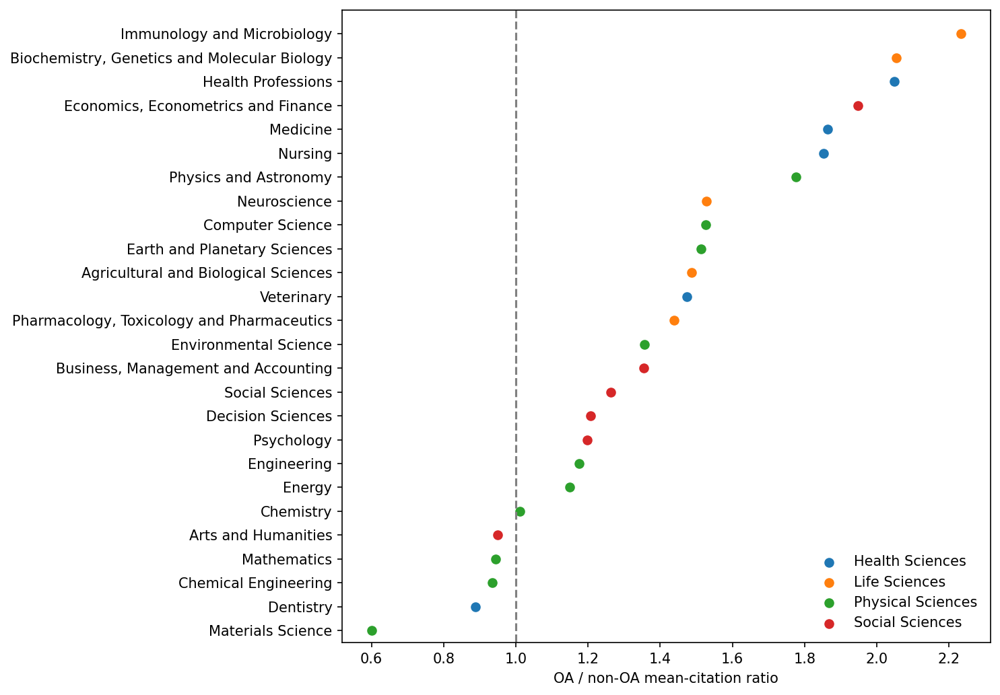

# oa-nooa-plot
OA-NOOA ratio plot

This repository contains the code and CI to generate a monthly updated plot of Open Access (OA) to Non-Open-Access (NOA) article ratios for different scientific fields.
The data is taken from OpenAlex (CC0)!

# Why

I was reading the Turing way and came along an outdated [Figure](https://book.the-turing-way.org/build/open-access-citation-62511e34ee086f9e4891405dfbcb615c.jpg).

Which was taken from a publication by [McKiernan et al.](https://doi.org/10.7554/eLife.16800).

# Output

